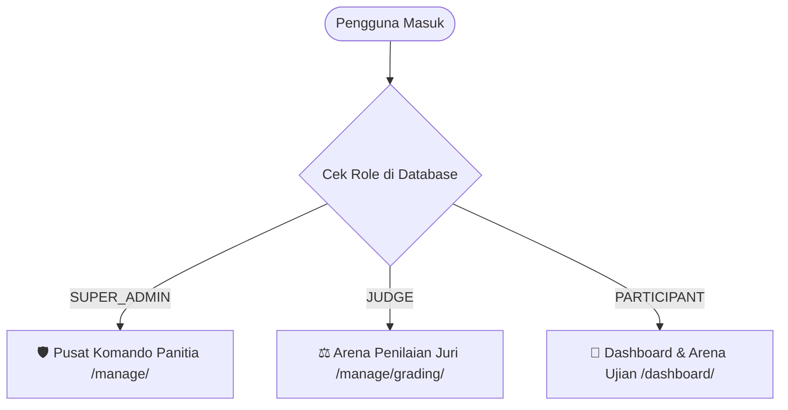

# 🛡️ Secure Web Quiz Platform
### *World-Class Secure Competition Arena for Cyber Defense & Hacker Contests*

[](https://www.python.org/)
[](https://www.djangoproject.com/)
[-orange.svg?logo=mysql&logoColor=white)](https://www.apachefriends.org/)
[](https://github.com/)
[](https://github.com/)

---

## 📖 Daftar Isi
1. [Apa Itu Platform Ini? (Penjelasan untuk Orang Awam)](#-apa-itu-platform-ini-penjelasan-untuk-orang-awam)
2. [Fitur Unggulan](#-fitur-unggulan)
3. [Peran Pengguna (Role System)](#-peran-pengguna-role-system)
4. [Kebutuhan Sistem (Prerequisites)](#-kebutuhan-sistem-prerequisites)
5. [Panduan Instalasi Langkah-demi-Langkah (Pemula Ramah)](#-panduan-instalasi-langkah-demi-langkah-pemula-ramah)
6. [Daftar Akun Siap Pakai (Uji Coba Cepat)](#-daftar-akun-siap-pakai-uji-coba-cepat)
7. [Peta Halaman & Navigasi URL](#-peta-halaman--navigasi-url)
8. [Struktur Folder Proyek](#-struktur-folder-proyek)
9. [Solusi Kendala Sering Terjadi (Troubleshooting FAQ)](#-solusi-kendala-sering-terjadi-troubleshooting-faq)
10. [Prinsip Arsitektur & Keamanan (Untuk Programmer)](#-prinsip-arsitektur--keamanan-untuk-programmer)

---

## 💡 Apa Itu Platform Ini? (Penjelasan untuk Orang Awam)

Bayangkan sebuah **aplikasi ujian online (Computer-Based Test / CBT)** seperti yang biasa Anda temui di sekolah atau kampus. Namun, aplikasi ini **didesain khusus untuk kompetisi hacker dan praktisi keamanan siber**.

### Mengapa Perlu Aplikasi Khusus?
Pada kuis online biasa, peserta yang paham pemrograman komputer bisa dengan mudah melakukan kecurangan, seperti:
- Memajukan atau memundurkan jam di laptop agar waktu ujian tidak habis.
- Membuka menu *Inspect Element* di browser untuk mengintip kunci jawaban atau kode rahasia.
- Menjalankan robot (*script otomatis*) untuk menembak jawaban ratusan kali per detik.

**Secure Web Quiz Platform** memecahkan masalah tersebut dengan prinsip **"Zero Trust" (Tidak Pernah Percaya pada Laptop/Browser Peserta)**. 
- Waktu ujian **100% dihitung oleh jam server pusat**. Jika peserta memanipulasi jam laptopnya, waktu ujian di server tetap berjalan akurat.
- Jawaban disimpan secara **otomatis (*real-time autosave*)**, sehingga jika koneksi internet mendadak putus atau laptop mati lampu, peserta tidak perlu panik karena jawaban terakhir sudah aman tersimpan di pusat data.
- Tampilannya bergaya **Cyber Mission Control** (nuansa gelap futuristik ala film fiksi ilmiah siber), lengkap dengan indikator status, peta navigasi soal, dan pencatat aktivitas mencurigakan.

---

## 🚀 Fitur Unggulan

| Fitur | Manfaat untuk Peserta / Pengguna | Manfaat untuk Panitia & Juri |
| :--- | :--- | :--- |
| **Server-Enforced Timer** | Peserta tahu sisa waktu yang adil dan sinkron dengan server. | Mencegah peserta memperpanjang durasi ujian secara ilegal. |
| **Realtime Autosave** | Jawaban tersimpan otomatis tiap beberapa detik tanpa perlu klik tombol simpan berkali-kali. | Mengurangi komplain kehilangan jawaban akibat insiden teknis lokal. |
| **Cyber Mission Control UI** | Antarmuka gelap yang nyaman di mata (*dark mode*), font monospace tabular, dan indikator warna status soal. | Memberikan kesan kompetisi kelas atas bertaraf internasional. |
| **Audit Log Forensik** | Bukti rekaman waktu pengerjaan yang transparan. | Mendeteksi jika peserta berpindah tab browser, mencatat alamat IP, dan waktu perubahan jawaban. |
| **Dual Penilaian (Otomatis & Juri)** | Nilai pilihan ganda langsung terhitung secara objektif. | Dewan juri memiliki ruang khusus (*Grading Arena*) untuk menilai jawaban essay teknis. |
| **Karantina Lampiran Soal** | Peserta dapat mengunduh berkas skenario atau log analisis dengan aman. | File unduhan diproteksi token berbatas waktu untuk mencegah pencurian soal. |

---

## 👥 Peran Pengguna (Role System)

Sistem ini membagi akses pengguna menjadi 3 tingkat wewenang:



1. **🛡️ Super Admin / Panitia**:
   - Membuka dan menutup babak kompetisi.
   - Mengelola bank soal, opsi pilihan ganda, rubrik essay, dan file skenario.
   - Memantau peserta yang sedang bertanding dan menginspeksi log audit integritas.
2. **⚖️ Dewan Juri (Judge)**:
   - Khusus membaca dan memberikan nilai serta catatan umpan balik pada jawaban essay teknis peserta.
3. **🎯 Peserta (Participant)**:
   - Melihat daftar kuis yang aktif, memulai sesi ujian, mengerjakan soal di dalam arena kuis, dan melihat skor hasil akhir (setelah dipublikasikan).

---

## 💻 Kebutuhan Sistem (Prerequisites)

Sebelum menjalankan aplikasi, pastikan komputer Anda telah memiliki:

1. **Python** versi `3.11`, `3.12`, atau `3.13` ([Unduh di python.org](https://www.python.org/downloads/)).
   > *Catatan*: Saat menginstal Python di Windows, pastikan mencentang kotak **"Add Python to PATH"**.
2. **XAMPP 8.2** ([Unduh di apachefriends.org](https://www.apachefriends.org/)).
   > Digunakan untuk menjalankan database **MySQL / MariaDB** serta antarmuka visual **phpMyAdmin**.
3. **Web Browser Modern** (Google Chrome, Mozilla Firefox, Microsoft Edge, atau Brave).

---

## 🛠️ Panduan Instalasi Langkah-demi-Langkah (Pemula Ramah)

Ikuti panduan berikut secara berurutan. Panduan ini menggunakan contoh folder standar `E:\xampp 8.2\htdocs\secure-web`.

### Langkah 1: Nyalakan MySQL di XAMPP
1. Buka aplikasi **XAMPP Control Panel**.
2. Cari baris **MySQL**, lalu klik tombol **Start**.
3. Pastikan modul MySQL berubah warna menjadi **Hijau** dengan status port `3306`.
*(Opsional: Anda juga boleh menyalakan Apache jika ingin membuka phpMyAdmin via browser).*

---

### Langkah 2: Buat Database MySQL
Anda bisa memilih salah satu dari dua cara berikut:

* **Cara A (Melalui Browser - phpMyAdmin)**:
  1. Nyalakan Apache di XAMPP, lalu buka `http://localhost/phpmyadmin/`.
  2. Klik menu **Databases** (Basis data) di bagian atas.
  3. Masukkan nama database: `secure_quiz_db`.
  4. Pilih collation: `utf8mb4_unicode_ci`.
  5. Klik tombol **Create**.

* **Cara B (Melalui Terminal / CMD XAMPP)**:
  Buka Terminal dan jalankan perintah:
  ```bash
  mysql -u root -e "CREATE DATABASE IF NOT EXISTS secure_quiz_db CHARACTER SET utf8mb4 COLLATE utf8mb4_unicode_ci;"
  ```

---

### Langkah 3: Buka Terminal di Folder Proyek
Buka aplikasi **PowerShell** atau **Terminal**, lalu arahkan ke lokasi folder proyek:
```powershell
cd "E:\xampp 8.2\htdocs\secure-web"
```

---

### Langkah 4: Aktifkan Virtual Environment (Lingkungan Python)
Proyek ini sudah dilengkapi dengan virtual environment bawaan di folder `.venv`:

* **Untuk Windows (PowerShell)**:
  ```powershell
  .venv\Scripts\Activate.ps1
  ```
  *(Jika muncul tanda `(.venv)` di awal baris perintah terminal Anda, tandanya lingkungan berhasil aktif).*

* **Untuk Windows (Command Prompt / CMD)**:
  ```cmd
  .venv\Scripts\activate.bat
  ```

> 💡 **Tips Pemula**: Jika muncul tulisan merah berisi error *Execution Policy* di PowerShell, jalankan perintah berikut sekali saja:
> ```powershell
> Set-ExecutionPolicy -Scope Process -ExecutionPolicy Bypass
> ```
> Lalu ulangi perintah aktivasi `.venv\Scripts\Activate.ps1`.

---

### Langkah 5: Pasang Dependensi / Pustaka (Jika Diperlukan)
Pastikan seluruh pustaka yang dibutuhkan aplikasi terpasang dengan menjalankan:
```powershell
pip install -r requirements.txt
```

---

### Langkah 6: Periksa File Konfigurasi `.env`
Pastikan terdapat file bernama `.env` di folder utama proyek (sejajar dengan file `manage.py`). Jika belum ada, salin dari `.env.example`:
```powershell
cp .env.example .env
```
Isi konfigurasi standar untuk XAMPP default tanpa password adalah:
```ini
DEBUG=True
SECRET_KEY=django-insecure-secure-web-quiz-super-secret-key-2026-top-tier
ALLOWED_HOSTS=127.0.0.1,localhost

DB_NAME=secure_quiz_db
DB_USER=root
DB_PASSWORD=
DB_HOST=127.0.0.1
DB_PORT=3306
```

---

### Langkah 7: Terapkan Skema Database (Migrasi)
Jalankan perintah ini agar tabel-tabel aplikasi otomatis terbuat di dalam database MySQL:
```powershell
python manage.py migrate
```
Jika berhasil, terminal akan menampilkan tanda centang `[OK]` untuk seluruh aplikasi (`accounts`, `competitions`, `questions`, `attempts`, `grading`, `audit`).

---

### Langkah 8: Masukkan Data Pengujian & Akun Contoh (Seeding Data)
Agar Anda tidak perlu membuat soal dan akun secara manual dari nol, jalankan skrip seeder otomatis:
```powershell
python scripts/seed_realistic_dummy.py
```
Skrip ini akan otomatis menyiapkan kompetisi siber realistis, puluhan soal pilihan ganda & essay, dewan juri, serta peserta yang siap dipakai ujian.

---

### Langkah 9: Jalankan Server Lokal
Nyalakan server pengembangan Django:
```powershell
python manage.py runserver 8001
```

Terminal akan menampilkan pesan:
```text
Starting development server at http://127.0.0.1:8001/
Quit the server with CTRL-BREAK.
```

---

### Langkah 10: Buka Aplikasi di Browser
Buka peramban (browser) favorit Anda dan kunjungi:
👉 **[http://127.0.0.1:8001/](http://127.0.0.1:8001/)**

Selamat! Platform kuis keamanan siber Anda sudah siap digunakan! 🎉

---

## 🔑 Daftar Akun Siap Pakai (Uji Coba Cepat)

Setiap akun pengujian dikonfigurasi dengan kata sandi berkekuatan tinggi (Enterprise Hardened) sesuai standar keamanan:

| No | Username | Password | Peran (Role) | Keterangan & Tujuan Uji Coba | URL yang Diakses |
| :-: | :--- | :--- | :--- | :--- | :--- |
| **1** | `developer` | `devSecOps2026!` | **Developer** | Lead DevSecOps. Akses eksklusif Disaster Recovery & Backup Vault. | [http://127.0.0.1:8001/manage/system/backup/](http://127.0.0.1:8001/manage/system/backup/) |
| **2** | `admin` | `Adm!nCyber#2026` | **Super Admin** | Panitia Pusat. Akses penuh ke statistik, live monitor, dan manajemen kompetisi. | [http://127.0.0.1:8001/manage/](http://127.0.0.1:8001/manage/) |
| **3** | `juri_siber` | `Jur!S1ber#2026` | **Judge (Juri)** | Dewan Juri (BSSN). Bertugas memeriksa jawaban essay peserta dan memberi nilai. | [http://127.0.0.1:8001/manage/grading/](http://127.0.0.1:8001/manage/grading/) |
| **4** | `dr_sec_lead` | `DrSec#Lead2026!` | **Judge (Juri)** | Forensic Lead. Alternatif akun juri kedua. | [http://127.0.0.1:8001/manage/grading/](http://127.0.0.1:8001/manage/grading/) |
| **5** | `byte_ninja` | `ByteN!nja2026#` | **Participant** | Peserta aktif (ITB). Sedang dalam sesi ujian berjalan (countdown live aktif). | [http://127.0.0.1:8001/dashboard/](http://127.0.0.1:8001/dashboard/) |
| **6** | `pwn_master` | `PwnM@ster2026!` | **Participant** | Peserta aktif kedua (UI) dengan sisa waktu berbeda. | [http://127.0.0.1:8001/dashboard/](http://127.0.0.1:8001/dashboard/) |
| **7** | `hacker_one` | `H@ck3rOne2026!` | **Participant** | Peserta yang sudah selesai ujian (status *Submitted*). | [http://127.0.0.1:8001/dashboard/](http://127.0.0.1:8001/dashboard/) |

*(Catatan lengkap profil peserta dan institusi dapat dilihat di file lokal `pengguna.txt`).*

---

## 🗺️ Peta Halaman & Navigasi URL

Berikut adalah daftar alamat penting di dalam aplikasi:

```text
http://127.0.0.1:8001/
├── login/                        -> Halaman Masuk Pengguna
├── dashboard/                    -> Portal Utama Peserta (Daftar Ujian Aktif)
├── competitions/<id>/start/      -> Konfirmasi Mulai Ujian
├── attempts/<id>/arena/          -> Arena Ujian Utama (Soal, Timer, Opsi Jawaban)
├── attempts/<id>/result/         -> Rekap Hasil Ujian Peserta
├── manage/                       -> Pusat Komando Panitia (Mission Control Admin)
│   ├── grading/                  -> Ruang Penilaian Jawaban Essay oleh Juri
│   ├── live-monitor/             -> Pemantauan Status Peserta Secara Real-Time
│   └── audit-log/                -> Log Audit Integritas & Deteksi Anomali
└── admin/                        -> Django Raw Admin (Pengelolaan Database Tingkat Lanjut)
```

---

## 📂 Struktur Folder Proyek

Untuk mempermudah programmer pemula mempelajari struktur kodingan, berikut penjelasan bagian-bagian penting dalam proyek:

```text
secure-web/
├── apps/                         # Modul-modul fitur utama aplikasi (Django Apps)
│   ├── accounts/                 # Akun pengguna, role (Admin/Juri/Peserta), dan autentikasi
│   ├── competitions/             # Babak kompetisi, jadwal mulai/selesai, dan pendaftaran
│   ├── questions/                # Bank soal (Pilihan Ganda & Essay), opsi jawaban, file skenario
│   ├── attempts/                 # Sesi ujian peserta, autosave jawaban, dan arena kuis
│   ├── grading/                  # Penilaian otomatis & penilaian manual oleh dewan juri
│   ├── audit/                    # Pencatatan log keamanan, jejak IP, dan deteksi ganti tab
│   └── management/               # Halaman antarmuka khusus panitia & dashboard admin
├── services/                     # Service Layer (Logika bisnis utama dipusatkan di sini)
│   ├── attempt_service.py        # Logika validasi waktu ujian, autosave, & submit aman
│   ├── grading_service.py        # Logika perhitungan skor otomatis dan kalkulasi essay
│   └── integrity_service.py      # Logika deteksi kecurangan dan pencatatan audit log
├── config/                       # Pengaturan inti proyek Django
│   ├── settings.py               # Konfigurasi database MySQL, middleware, & keamanan
│   ├── urls.py                   # Peta perutean (routing) URL utama
│   └── __init__.py               # Patch kompatibilitas PyMySQL & MariaDB XAMPP otomatis
├── scripts/                      # Skrip bantu otomasi
│   └── seed_realistic_dummy.py   # Pengisi data awal kompetisi dan akun siap pakai
├── static/                       # File aset statis antarmuka (CSS, JavaScript, Ikon)
│   ├── css/cyberpunk_theme.css   # Desain tema Cyber Mission Control & Glassmorphism
│   └── js/exam_engine.js         # Mesin timer sinkron dan sistem autosave di browser
├── templates/                    # File HTML tampilan web
│   ├── attempts/exam_arena.html  # Tampilan ruang ujian peserta
│   ├── management/               # Tampilan portal admin dan ruang juri
│   └── accounts/login.html       # Tampilan halaman masuk modern
├── .env                          # File rahasia berisi konfigurasi database dan kunci keamanan
├── manage.py                     # Skrip utama pengendali Django melalui terminal
├── requirements.txt              # Daftar pustaka Python yang wajib terpasang
└── pengguna.txt                  # Catatan kredensial akun uji coba
```

---

## ❓ Solusi Kendala Sering Terjadi (Troubleshooting FAQ)

### 1. Error: `Can't connect to MySQL server on '127.0.0.1'`
* **Penyebab**: Modul MySQL di aplikasi XAMPP belum menyala.
* **Solusi**: Buka **XAMPP Control Panel**, cari baris **MySQL**, lalu klik tombol **Start**. Pastikan statusnya berwarna hijau.

### 2. Error: `Unknown database 'secure_quiz_db'`
* **Penyebab**: Database belum dibuat di MySQL XAMPP Anda.
* **Solusi**: Buka `http://localhost/phpmyadmin/`, klik menu **Databases**, masukkan nama `secure_quiz_db`, lalu klik **Create**. Setelah itu, jalankan kembali perintah `python manage.py migrate`.

### 3. PowerShell: `File .venv\Scripts\Activate.ps1 cannot be loaded because running scripts is disabled`
* **Penyebab**: Kebijakan keamanan Windows PowerShell membatasi eksekusi skrip otomatis.
* **Solusi**: Buka PowerShell biasa, lalu ketik perintah berikut:
  ```powershell
  Set-ExecutionPolicy -Scope Process -ExecutionPolicy Bypass
  ```
  Lalu coba aktifkan virtual environment kembali.

### 4. Error: `Port 8001 is already in use`
* **Penyebab**: Ada aplikasi lain yang sedang memakai port `8001`.
* **Solusi**: Anda bisa mengganti angka port ke angka lain, misalnya `8002` atau `8080`:
  ```powershell
  python manage.py runserver 8002
  ```
  Lalu buka browser di `http://127.0.0.1:8002/`.

---

## 🧠 Prinsip Arsitektur & Keamanan (Untuk Programmer)

Bagi Anda yang ingin mempelajari atau mengembangkan kode di proyek ini, sistem ini dibangun mengikuti standar industri kelas enterprise:

1. **Service Layer Pattern**:
   Logika bisnis penting (seperti kalkulasi sisa waktu, penyimpanan jawaban, dan perhitungan nilai) **tidak ditulis di dalam Views/Templates**, melainkan dipusatkan di folder `services/`. Hal ini membuat kode mudah diuji (*testable*) dan mudah dirawat (*maintainable*).
2. **Atomic Transactions & Row Locking (`select_for_update`)**:
   Setiap kali peserta menyimpan jawaban atau melakukan submit ujian, operasi database dibungkus dengan `transaction.atomic()` dan *row-level locking*. Hal ini mencegah terjadinya *race conditions* (misalnya menekan tombol submit berkali-kali secara bersamaan).
3. **Database-Level Integrity Constraints**:
   Validasi integritas tidak hanya mengandalkan kode Python, melainkan dijaga langsung oleh MySQL menggunakan `UniqueConstraint` (mencegah satu peserta memiliki sesi ganda) dan `CheckConstraint`.
4. **Zero-Trust Client Defense**:
   Backend tidak pernah mempercayai parameter waktu yang dikirim oleh JavaScript browser. Sisa durasi ujian selalu dihitung ulang dari selisih `started_at + duration` di server secara matematis.
5. **MariaDB XAMPP Auto-Patch**:
   File `config/__init__.py` secara cerdas mengonfigurasi `PyMySQL` dan menonaktifkan fitur `RETURNING clause` yang tidak didukung versi lama MariaDB pada XAMPP, sehingga sistem berjalan mulus tanpa perlu kompilasi driver C/C++.

---

## 📄 Lisensi & Kontribusi

Proyek ini dikembangkan untuk kebutuhan perlombaan dan riset keamanan sistem informasi. Silakan gunakan, pelajari kodenya, dan adaptasi sesuai kebutuhan etis Anda.

> **Stay Secure, Code Cleanly, and Defend the Perimeter!** 🛡️⚡
